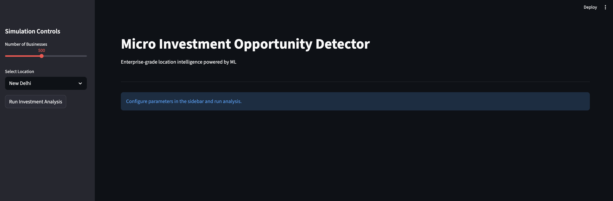
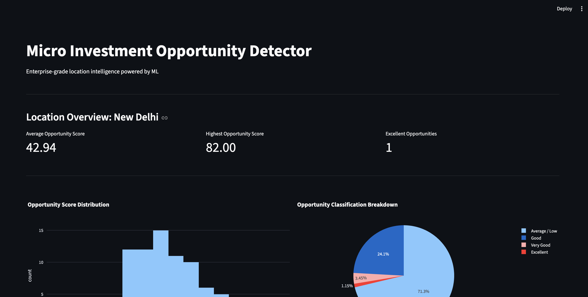
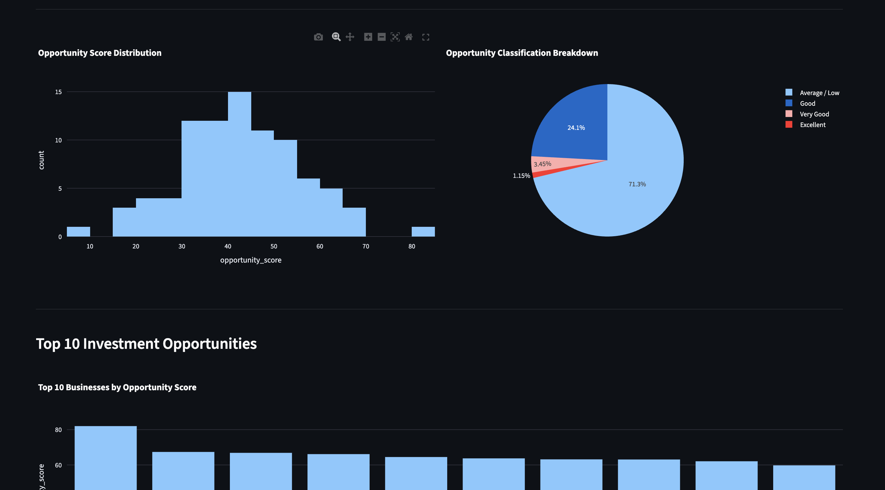
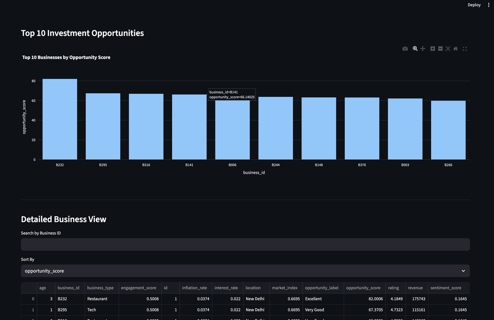
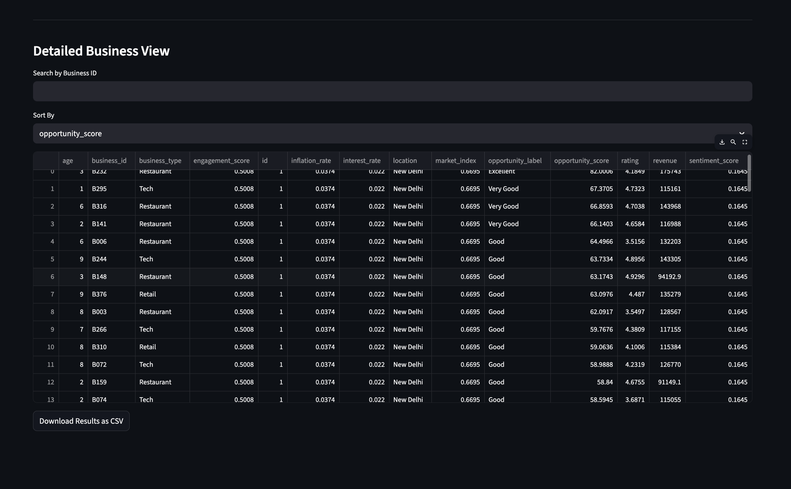

# Micro Investment Opportunity Detector (MIOD)

## Overview

Micro Investment Opportunity Detector (MIOD) is a full-stack machine learning system designed to evaluate micro-investment opportunities for small businesses across different locations.

The system integrates:

- Sentiment analysis using VADER  
- A Random Forest regression model  
- A normalized MySQL database  
- A Flask-based REST API  
- A Streamlit analytics dashboard  

The architecture separates training and inference, persists model artifacts, and retrieves structured data from a relational database using indexed queries.

This project demonstrates end-to-end ML system design, backend engineering, and data-driven decision workflows.

---

## System Architecture

The system follows a layered architecture:

Streamlit (Frontend Dashboard)  
→ Flask REST API  
→ MySQL Database  
→ Feature Engineering Pipeline  
→ Random Forest Model (Inference)

Training and inference are handled separately.

- `train_model.py` trains and saves the model artifact.
- `api.py` loads the saved model and serves predictions.
- The Streamlit application calls the API for scoring.

---

## Key Features

- Location-based investment opportunity scoring  
- VADER-based sentiment aggregation at location level  
- Random Forest regression model with feature importance  
- Normalized MySQL schema with indexed location queries  
- Connection pooling for improved database efficiency  
- Environment-based configuration using `.env`  
- RESTful API with structured validation and logging  
- Interactive Streamlit dashboard with visual analytics  

---

## Database Design

The system uses a normalized MySQL schema:

### 1. businesses

Stores structured business-level features.

- business_id (Primary Key)  
- location (Indexed)  
- business_type  
- revenue  
- age  
- rating  

### 2. sentiment_aggregates

Stores aggregated sentiment metrics per location.

- location (Primary Key)  
- sentiment_score  
- engagement_score  

### 3. economic_indicators

Stores macroeconomic indicators.

- id (Primary Key)  
- inflation_rate  
- interest_rate  
- market_index  

Location is indexed to enable efficient filtering and retrieval.

---

## Model Details

**Model Type:**  
Random Forest Regressor

**Features Used:**

- sentiment_score  
- revenue  
- age  
- rating  
- inflation_rate  
- interest_rate  

**Target Variable:**  
A synthetic opportunity score (0–100) generated using correlated business and macroeconomic factors with controlled noise.

**Evaluation Metrics:**

- Mean Squared Error (MSE)  
- R² Score  

The trained model is serialized using `joblib` and loaded by the API for inference.

---

## Project Structure

```
models/
    opportunity_scorer.py
    sentiment_model.py
    opportunity_model.pkl

services/
    data_service.py

utils/
    feature_pipeline.py
    mock_data_generator.py
    data_collector.py

scripts/
    populate_database.py

api.py
app.py
database.py
train_model.py
requirements.txt
README.md
```

---

## Setup Instructions

### 1. Clone the Repository

```
git clone <your-repo-url>
cd Micro-Investment-Opportunity-Detector_MIOD
```

### 2. Create Virtual Environment

```
python -m venv venv
source venv/bin/activate  # Mac/Linux
```

### 3. Install Dependencies

```
pip install -r requirements.txt
```

### 4. Configure Environment Variables

Create a `.env` file in the project root:

```
DB_HOST=localhost
DB_USER=root
DB_PASSWORD=your_password
DB_NAME=miod_db
```

Do not commit this file to version control.

---

## Database Initialization

1. Create the database in MySQL:

```
CREATE DATABASE miod_db;
USE miod_db;
```

2. Create the required tables (see Database Design section).

3. Populate the database:

```
python -m scripts.populate_database
```

---

## Model Training

Train and save the model artifact:

```
python train_model.py
```

This creates:

```
models/opportunity_model.pkl
```

---

## Running the Application

### 1. Start the Flask API

```
python api.py
```

The API will run at:

```
http://127.0.0.1:5000
```

You can verify:

```
http://127.0.0.1:5000/health
```

### 2. Start the Streamlit Dashboard

In a separate terminal:

```
streamlit run app.py
```

The dashboard will call the REST API to fetch scored investment opportunities.

---

## API Endpoint

### POST `/score`

Request:

```
{
    "location": "Mumbai"
}
```

Response:

```
{
    "location": "Mumbai",
    "total_businesses": 100,
    "results": [...]
}
```

---

## Screenshots

### Dashboard Overview




### Opportunity Distribution




### Score Distribution




### Top Investment Opportunities




### View Businesses Data 




---

## Engineering Highlights

- Clean separation of concerns between training and inference  
- REST API serving serialized ML model  
- Indexed location queries in MySQL  
- Connection pooling for scalable DB access  
- Modular service layer for data retrieval  
- Environment-based configuration  
- Interactive frontend consuming backend API  

---

## Possible Extensions

- Deploy backend to cloud (Render, Railway, etc.)  
- Add API authentication  
- Integrate real external data sources  
- Add SHAP-based explainability  
- Containerize using Docker  
- Add multi-location comparison analytics  
