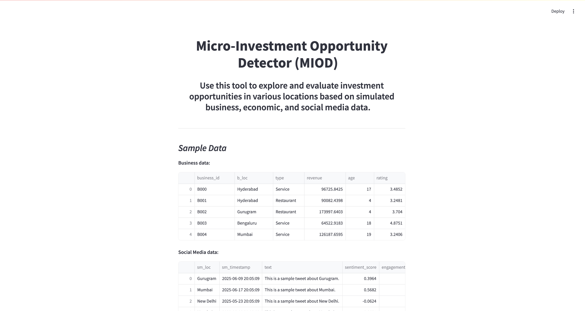
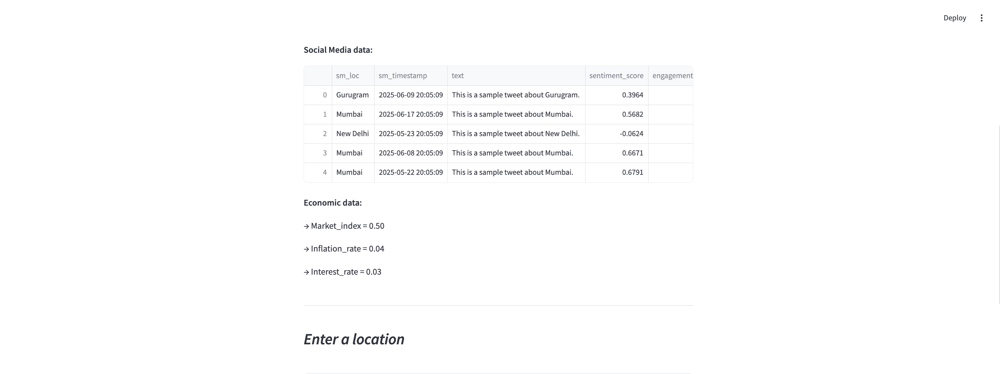
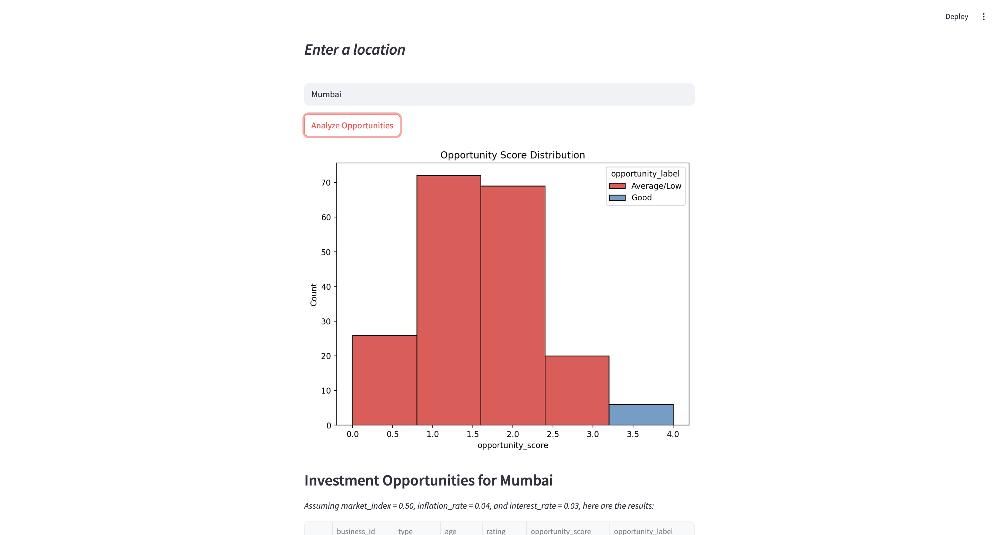
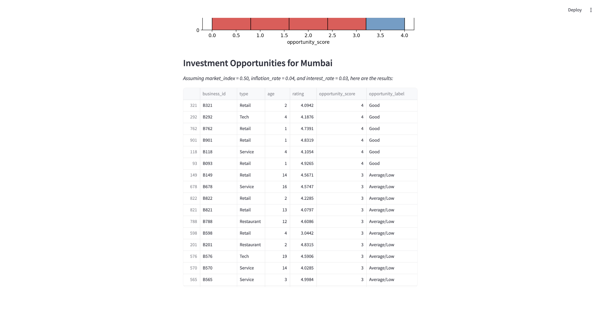

# Micro-Investment Opportunity Detector (MIOD)

An interactive web application that simulates and evaluates micro-investment opportunities across various locations using mock business, economic, and social media sentiment data.
An interactive web application that simulates and evaluates micro-investment opportunities across various locations using mock business, economic, and social media sentiment data. It performs sentiment analysis on social media text using VADER Sentiment Analyzer and utilizes a Random Forest machine learning model to score and classify investment opportunities.

---

## Preview

---

## Features

- Simulates Business, Economic, and Social Media Data
- Performs Sentiment Analysis using VADER on Social Media data
- Calculates Investment Opportunity Scores using a trained Random Forest model
- Interactive Streamlit Web App Interface
- Location-specific investment analysis

---

## Model Details

### Sentiment Analysis

- **Library:** VADER SentimentIntensityAnalyzer
- **Input:** Simulated social media text data
- **Output:** Compound Sentiment Score (range -1 to 1)

### Investment Opportunity Scorer

- **Model:** Random Forest Regressor
- **Features Used:**  
  - Business Type
  - Business Rating
  - Business Age
  - Sentiment Score (from social media)
  - Market Index
  - Inflation Rate
  - Interest Rate
- **Output:** Numerical Opportunity Score + Classified Label
- **Label Categories:** 
  - `Excellent`
  - `Very Good`
  - `Good`
  - `Average/Low`

### Data Generation

- Generates randomized mock data for:
  - Business Data (type, rating, age)
  - Economic Data (market index, inflation rate, interest rate)
  - Social Media Data (text sentiment, location)

---

## Run Locally

1.Clone the repository
git clone https://github.com/siddharth23k/Micro-Investment-Opportunity-Detector.git
cd Micro-Investment-Opportunity-Detector
2️. Install dependencies
pip install -r requirements.txt
3️. Run the Streamlit app
streamlit run app.py

## Future Improvements
- Incorporate real-time social media data scraping(Example: using tweepy)
- Use real business and economic datasets
- User authentication & cloud deployment
- Use neural network for better predictions and give final output of "yes/no" to invest
